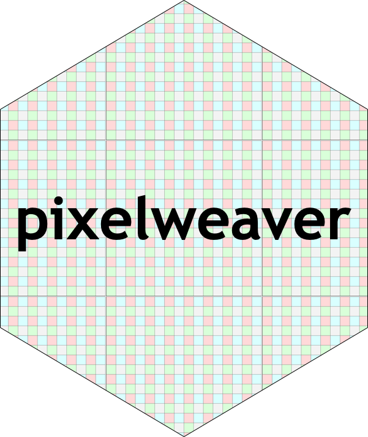
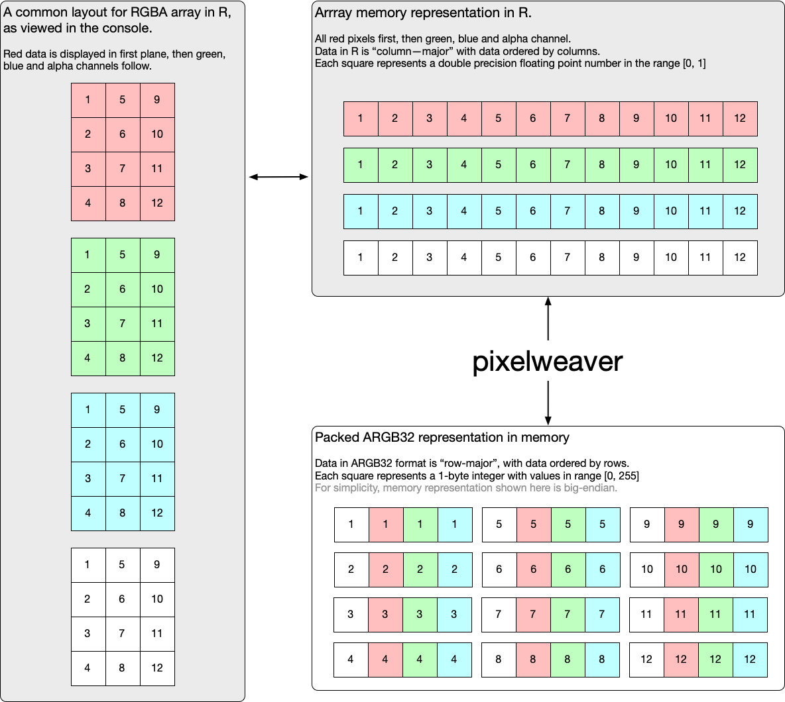

<!-- README.md is generated from README.Rmd. Please edit that file -->

```{r, include = FALSE}
knitr::opts_chunk$set(
  collapse = FALSE,
  comment = "#>",
  fig.path = "man/figures/README-",
  out.width = "100%"
)

library(pixelweaver)
```

# pixelweaver  

<!-- badges: start -->

[](https://github.com/coolbutuseless/pixelweaver/actions)
<!-- badges: end -->

`pixelweaver` provides functions for converting R matrices and arrays into
common packed pixel representations

The packed pixel data is stored in memory and referenced by an external pointer.  This
data can then either:

* manipulated and then converted back to matrix or array 
* be passed to other C library wrappers written in R which understand external pointers.
* converted to a vector of raw values 


### Why?

*Rstats* commonly stores pixel information in arrays, where the R, G, B and A values
are specified as separate planes of an array (in that order).  Values in the 
array are commonly real numbers in the range [0, 1]

Very few C graphics libraries support this planar color representation. 

One common format C libraries support is packing the R, G, B and A values for a single
pixel into a 32-bit sequence - with 1-byte for each of the colors.

`pixelweaver` provides functions for converting R's planar color representation to/from
 packed pixel representation.

An overview/schematic of the pixel representations and where `pixelweaver` sits is 
illustrated below.




## ToDo

* Support direct use of a vector of raw data in `packed_to_planar()`
* Support direct output of a vector of raw data from `planar_to_packed()`
* Support copying into pre-allocated arrays to avoid having to allocate new
  memory each time.
* Faster algorithms for the transpose and shuffle.  MMX? SSE? AVX?


## Installation

You can install from [GitHub](https://github.com/coolbutuseless/pixelweaver) with:

``` r
# install.package('remotes')
remotes::install_github('coolbutuseless/pixelweaver')
```

## What's in the box

* `packed_to_planar()`, `planar_to_packed()` - convert matrices and arrays to/from
  packed pixel formats.  These functions store the packed data as a sequence of
  bytes in memory and return an external pointer to this memory.
* `packed_to_raw()`, `raw_to_packed()` - convert the package packed format from 
  an external pointer (to data in memory) to a vector of raw values in R.  These 
  functions are different from the `planar` functions in that the data is
  returned in the same layout as the memory i.e. raw vector represents pixels
  in row-major format, not column-major
* Support for ARGB32, RGBA32 and ABGR32 pixel format. 

## Conversion of an RGBA array to ARGB32 format and back again.

```{r example, out.width = "40%"}
library(pixelweaver)

#~~~~~~~~~~~~~~~~~~~~~~~~~~~~~~~~~~~~~~~~~~~~~~~~~~~~~~~~~~~~~~~~~~~~~~~~~~~~~
# Create an an array with 3 planes representing RGB color data
#~~~~~~~~~~~~~~~~~~~~~~~~~~~~~~~~~~~~~~~~~~~~~~~~~~~~~~~~~~~~~~~~~~~~~~~~~~~~~
(arr <- array(seq(4*3*3)/36, c(4, 3, 3)))
plot(as.raster(arr), interpolate = FALSE)


#~~~~~~~~~~~~~~~~~~~~~~~~~~~~~~~~~~~~~~~~~~~~~~~~~~~~~~~~~~~~~~~~~~~~~~~~~~~~~
# Convert the R planar color representation to packed ARGB32 format 
# This is a pointer to a memory location that contains the data
#~~~~~~~~~~~~~~~~~~~~~~~~~~~~~~~~~~~~~~~~~~~~~~~~~~~~~~~~~~~~~~~~~~~~~~~~~~~~~
packed_ptr <- planar_to_packed(arr, format = pack_fmt$ARGB32, maxval = 1)
packed_ptr


#~~~~~~~~~~~~~~~~~~~~~~~~~~~~~~~~~~~~~~~~~~~~~~~~~~~~~~~~~~~~~~~~~~~~~~~~~~~~~
# View the raw data. Note the value = 255 every 4th value - this is the 
# default alpha value set for each pixel
#~~~~~~~~~~~~~~~~~~~~~~~~~~~~~~~~~~~~~~~~~~~~~~~~~~~~~~~~~~~~~~~~~~~~~~~~~~~~~
as.integer(packed_to_raw(packed_ptr))


#~~~~~~~~~~~~~~~~~~~~~~~~~~~~~~~~~~~~~~~~~~~~~~~~~~~~~~~~~~~~~~~~~~~~~~~~~~~~~
# Convert the R, G and Blue values from the packed ARGB32 representation 
# back into the original representation
#~~~~~~~~~~~~~~~~~~~~~~~~~~~~~~~~~~~~~~~~~~~~~~~~~~~~~~~~~~~~~~~~~~~~~~~~~~~~~
(arr_out <- packed_to_planar(packed_ptr, format = pack_fmt$ARGB32, nchannel = 3))
plot(as.raster(arr_out), interpolate = FALSE)


#~~~~~~~~~~~~~~~~~~~~~~~~~~~~~~~~~~~~~~~~~~~~~~~~~~~~~~~~~~~~~~~~~~~~~~~~~~~~~
# Convert the R, G and Blue values from the packed ARGB32 representation 
# back into a grey matrix using  0.3R + 0.59G + 0.11B
#~~~~~~~~~~~~~~~~~~~~~~~~~~~~~~~~~~~~~~~~~~~~~~~~~~~~~~~~~~~~~~~~~~~~~~~~~~~~~
(mat_out <- packed_to_planar(packed_ptr, format = pack_fmt$ARGB32, nchannel = 1))
plot(as.raster(mat_out), interpolate = FALSE)
```


## Acknowledgements

* R Core for developing and maintaining the language.
* CRAN maintainers, for patiently shepherding packages onto CRAN and maintaining
  the repository
