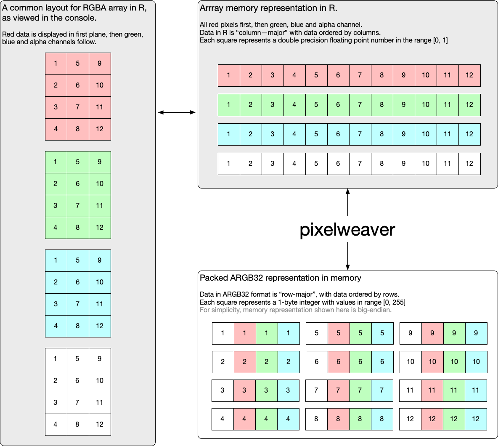

<!-- README.md is generated from README.Rmd. Please edit that file -->

# pixelweaver 

<!-- badges: start -->


<!-- badges: end -->

`pixelweaver` provides functions for converting R matrices and arrays
into a common packed integer representation - `ARGB32`

The ARGB32 data is stored in memory and referenced by an external
pointer. This data can then either:

  - manipulated and then converted back to matrix or array
  - be passed to other C library wrappers written in R which understand
    external pointers.
  - converted to a vector of raw values

### Why?

*Rstats* commonly stores pixel information in arrays, where the R, G, B
and A values are specified as separate planes of an array (in that
order). Values in the array are commonly real numbers in the range \[0,
1\]

Very few C graphics libraries support this planar colour representation.

One common format C libraries support is ARGB32 - where a single byte is
used to represent each of the A, R, G and B values (each value is in the
range \[0, 255\]). These bytes are then lumped together as a 4-byte
sequence.

`pixelweaver` provides functions for converting R’s planar colour
representation to/from the packed ARGB32 representation.

An overview/schematic of the pixel representations and where
`pixelweaver` sits is illustrated below.



## Future possibilities

  - Support copying into pre-allocated arrays to avoid having to
    allocate new memory each time.
  - Faster algorithms for the transpose and shuffle. MMX? SSE? AVX?
  - Other pixel formats e.g. RGBA32
  - Support for big-endian systems (are there any such systems in common
    use with R?)

## Installation

You can install from
[GitHub](https://github.com/coolbutuseless/pixelweaver) with:

``` r
# install.package('remotes')
remotes::install_github('coolbutuseless/pixelweaver')
```

## What’s in the box

  - `argb32_to_planar()`, `planar_to_argb32()` - convert matrices and
    arrays to/from packed ARGB32 format. These functions store the
    ARGB32 data as a sequence of bytes in memory and return an external
    pointer to this memory.
  - `argb32_to_raw()`, `raw_to_argb32()` - convert the package ARGB32
    format from an external pointer (to data in memory) to a vector of
    raw values in R.

## Conversion of an RGBA array to ARGB32 format and back again.

``` r
library(pixelweaver)

#~~~~~~~~~~~~~~~~~~~~~~~~~~~~~~~~~~~~~~~~~~~~~~~~~~~~~~~~~~~~~~~~~~~~~~~~~~~~~
# Create an an array with 3 planes representing RGB colour data
#~~~~~~~~~~~~~~~~~~~~~~~~~~~~~~~~~~~~~~~~~~~~~~~~~~~~~~~~~~~~~~~~~~~~~~~~~~~~~
(arr <- array(seq(4*3*3)/36, c(4, 3, 3)))
```

    #> , , 1
    #> 
    #>            [,1]      [,2]      [,3]
    #> [1,] 0.02777778 0.1388889 0.2500000
    #> [2,] 0.05555556 0.1666667 0.2777778
    #> [3,] 0.08333333 0.1944444 0.3055556
    #> [4,] 0.11111111 0.2222222 0.3333333
    #> 
    #> , , 2
    #> 
    #>           [,1]      [,2]      [,3]
    #> [1,] 0.3611111 0.4722222 0.5833333
    #> [2,] 0.3888889 0.5000000 0.6111111
    #> [3,] 0.4166667 0.5277778 0.6388889
    #> [4,] 0.4444444 0.5555556 0.6666667
    #> 
    #> , , 3
    #> 
    #>           [,1]      [,2]      [,3]
    #> [1,] 0.6944444 0.8055556 0.9166667
    #> [2,] 0.7222222 0.8333333 0.9444444
    #> [3,] 0.7500000 0.8611111 0.9722222
    #> [4,] 0.7777778 0.8888889 1.0000000

``` r
plot(as.raster(arr), interpolate = FALSE)
```


``` r
#~~~~~~~~~~~~~~~~~~~~~~~~~~~~~~~~~~~~~~~~~~~~~~~~~~~~~~~~~~~~~~~~~~~~~~~~~~~~~
# Convert the R planar colour representation to packed ARGB32 format 
# This is a pointer to a memory location that contains the data
#~~~~~~~~~~~~~~~~~~~~~~~~~~~~~~~~~~~~~~~~~~~~~~~~~~~~~~~~~~~~~~~~~~~~~~~~~~~~~
argb32_ptr <- planar_to_argb32(arr, maxval = 1)
argb32_ptr
```

    #> <pointer: 0x7fd528e728b0>
    #> attr(,"class")
    #> [1] "unsigned char"

``` r
#~~~~~~~~~~~~~~~~~~~~~~~~~~~~~~~~~~~~~~~~~~~~~~~~~~~~~~~~~~~~~~~~~~~~~~~~~~~~~
# View the raw data. Note the value = 255 every 4th value - this is the 
# default alpha value set for each pixel
#~~~~~~~~~~~~~~~~~~~~~~~~~~~~~~~~~~~~~~~~~~~~~~~~~~~~~~~~~~~~~~~~~~~~~~~~~~~~~
as.integer(argb32_to_raw(argb32_ptr))
```

    #>  [1] 177  92   7 255 205 120  35 255 233 148  63 255 184  99  14 255 212 127  42
    #> [20] 255 240 155  70 255 191 106  21 255 219 134  49 255 247 162  77 255 198 113
    #> [39]  28 255 226 141  56 255 255 170  85 255

``` r
#~~~~~~~~~~~~~~~~~~~~~~~~~~~~~~~~~~~~~~~~~~~~~~~~~~~~~~~~~~~~~~~~~~~~~~~~~~~~~
# Convert the R, G and Blue values from the packed ARGB32 representation 
# back into the original representation
#~~~~~~~~~~~~~~~~~~~~~~~~~~~~~~~~~~~~~~~~~~~~~~~~~~~~~~~~~~~~~~~~~~~~~~~~~~~~~
(arr_out <- argb32_to_planar(argb32_ptr, 'rgb'))
```

    #> , , 1
    #> 
    #>            [,1]      [,2]      [,3]
    #> [1,] 0.02745098 0.1372549 0.2470588
    #> [2,] 0.05490196 0.1647059 0.2745098
    #> [3,] 0.08235294 0.1921569 0.3019608
    #> [4,] 0.10980392 0.2196078 0.3333333
    #> 
    #> , , 2
    #> 
    #>           [,1]      [,2]      [,3]
    #> [1,] 0.3607843 0.4705882 0.5803922
    #> [2,] 0.3882353 0.4980392 0.6078431
    #> [3,] 0.4156863 0.5254902 0.6352941
    #> [4,] 0.4431373 0.5529412 0.6666667
    #> 
    #> , , 3
    #> 
    #>           [,1]      [,2]      [,3]
    #> [1,] 0.6941176 0.8039216 0.9137255
    #> [2,] 0.7215686 0.8313725 0.9411765
    #> [3,] 0.7490196 0.8588235 0.9686275
    #> [4,] 0.7764706 0.8862745 1.0000000

``` r
plot(as.raster(arr_out), interpolate = FALSE)
```


``` r
#~~~~~~~~~~~~~~~~~~~~~~~~~~~~~~~~~~~~~~~~~~~~~~~~~~~~~~~~~~~~~~~~~~~~~~~~~~~~~
# Convert the R, G and Blue values from the packed ARGB32 representation 
# back into a grey matrix using  0.3R + 0.59G + 0.11B
#~~~~~~~~~~~~~~~~~~~~~~~~~~~~~~~~~~~~~~~~~~~~~~~~~~~~~~~~~~~~~~~~~~~~~~~~~~~~~
(mat_out <- argb32_to_planar(argb32_ptr, 'grey'))
```

    #>           [,1]      [,2]      [,3]
    #> [1,] 0.2974510 0.4072549 0.5170588
    #> [2,] 0.3249020 0.4347059 0.5445098
    #> [3,] 0.3523529 0.4621569 0.5719608
    #> [4,] 0.3798039 0.4896078 0.6033333

``` r
plot(as.raster(mat_out), interpolate = FALSE)
```


## Technical bits

  - ARGB32 or ARGB8888 format.
  - Each of A, R, G, B gets 1 byte (8 bits)
  - Together these 4 bytes fit in a standard ‘int32’
  - ‘A’ (alpha) is in the most significant byte
  - x86 systems are little-endian so when viewing these bytes one at a
    time, the order will be B, G, R, A. i.e. from least signficant to
    most significant byte

## Acknowledgements

  - R Core for developing and maintaining the language.
  - CRAN maintainers, for patiently shepherding packages onto CRAN and
    maintaining the repository
