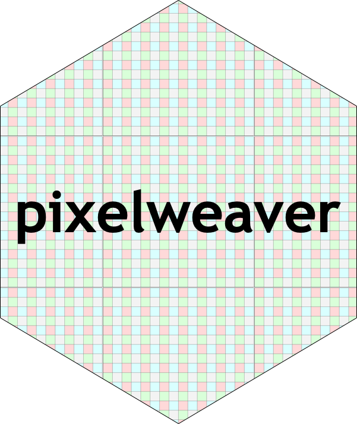

<!-- README.md is generated from README.Rmd. Please edit that file -->

# pixelweaver 

<!-- badges: start -->

 [](https://github.com/coolbutuseless/pixelweaver/actions)
<!-- badges: end -->

`pixelweaver` provides functions for converting R arrays (representing
planar colour) into packed colour representations

### Why?

When represening colour information in R, this is often stored in
*arrays* where each plane of the array represents a different color.
This is a **planar color** representation.

Very few C graphics libraries support this planar color representation.

One common format C libraries support is **packed colour**. With *packed
colour* the R, G, B and A values for a single pixel are stored into a
32-bit sequence - with 1-byte for each of the colors.

`pixelweaver` provides functions for converting R’s planar color
representation to/from packed colour representation.

An overview/schematic of the color representations and where
`pixelweaver` sits is illustrated below.


## ToDo

  - Support copying into pre-allocated arrays to avoid having to
    allocate new memory each time.
  - Faster algorithms for the transpose and shuffle. MMX? SSE? AVX?

## Installation

You can install from
[GitHub](https://github.com/coolbutuseless/pixelweaver) with:

``` r
# install.package('remotes')
remotes::install_github('coolbutuseless/pixelweaver')
```

## What’s in the box

  - `packed_to_planar()`, `planar_to_packed()` - convert matrices and
    arrays to/from packed color formats.  
  - `packed_ptr_to_raw()`, `packed_raw_to_ptr()` - convert the packed
    color format from an external pointer (pointing to data in memory)
    to a vector of raw values in R. These functions are different from
    the `planar` functions in that the data is returned in the same
    layout as the memory i.e. raw vector represents pixels in row-major
    format, not column-major
  - `shuffle()` - shuffle the arrangement of packed color in a vector of
    raw values. The shuffling is done in place, without allocating new
    storage.
  - Support for ARGB32, RGBA32 and ABGR32 pixel formats.

## Conversion of an planar array to packed ARGB32 format and back again.

``` r
library(pixelweaver)

#~~~~~~~~~~~~~~~~~~~~~~~~~~~~~~~~~~~~~~~~~~~~~~~~~~~~~~~~~~~~~~~~~~~~~~~~~~~~~
# Create an an array with 3 planes representing RGB color data
#~~~~~~~~~~~~~~~~~~~~~~~~~~~~~~~~~~~~~~~~~~~~~~~~~~~~~~~~~~~~~~~~~~~~~~~~~~~~~
(arr <- array(seq(4*3*3)/36, c(4, 3, 3)))
```

    #> , , 1
    #> 
    #>            [,1]      [,2]      [,3]
    #> [1,] 0.02777778 0.1388889 0.2500000
    #> [2,] 0.05555556 0.1666667 0.2777778
    #> [3,] 0.08333333 0.1944444 0.3055556
    #> [4,] 0.11111111 0.2222222 0.3333333
    #> 
    #> , , 2
    #> 
    #>           [,1]      [,2]      [,3]
    #> [1,] 0.3611111 0.4722222 0.5833333
    #> [2,] 0.3888889 0.5000000 0.6111111
    #> [3,] 0.4166667 0.5277778 0.6388889
    #> [4,] 0.4444444 0.5555556 0.6666667
    #> 
    #> , , 3
    #> 
    #>           [,1]      [,2]      [,3]
    #> [1,] 0.6944444 0.8055556 0.9166667
    #> [2,] 0.7222222 0.8333333 0.9444444
    #> [3,] 0.7500000 0.8611111 0.9722222
    #> [4,] 0.7777778 0.8888889 1.0000000

``` r
plot(as.raster(arr), interpolate = FALSE)
```


``` r
#~~~~~~~~~~~~~~~~~~~~~~~~~~~~~~~~~~~~~~~~~~~~~~~~~~~~~~~~~~~~~~~~~~~~~~~~~~~~~
# Convert the R planar color representation to packed ARGB32 format 
# This is a pointer to a memory location that contains the data
#~~~~~~~~~~~~~~~~~~~~~~~~~~~~~~~~~~~~~~~~~~~~~~~~~~~~~~~~~~~~~~~~~~~~~~~~~~~~~
packed_ptr <- planar_to_packed(arr, format = packed_fmt$ARGB32, maxval = 1, as_ptr = TRUE )
packed_raw <- planar_to_packed(arr, format = packed_fmt$ARGB32, maxval = 1, as_ptr = FALSE)
packed_ptr
```

    #> <pointer: 0x7f80ea54d160>
    #> attr(,"class")
    #> [1] "unsigned char"

``` r
#~~~~~~~~~~~~~~~~~~~~~~~~~~~~~~~~~~~~~~~~~~~~~~~~~~~~~~~~~~~~~~~~~~~~~~~~~~~~~
# View the raw data. Note the value = 255 every 4th value - this is the 
# default alpha value set for each pixel
#~~~~~~~~~~~~~~~~~~~~~~~~~~~~~~~~~~~~~~~~~~~~~~~~~~~~~~~~~~~~~~~~~~~~~~~~~~~~~
as.integer(packed_raw)
```

    #>  [1] 177  92   7 255 205 120  35 255 233 148  63 255 184  99  14 255 212 127  42
    #> [20] 255 240 155  70 255 191 106  21 255 219 134  49 255 247 162  77 255 198 113
    #> [39]  28 255 226 141  56 255 255 170  85 255

``` r
#~~~~~~~~~~~~~~~~~~~~~~~~~~~~~~~~~~~~~~~~~~~~~~~~~~~~~~~~~~~~~~~~~~~~~~~~~~~~~
# Convert the R, G and Blue values from the packed ARGB32 representation 
# back into the original representation
#~~~~~~~~~~~~~~~~~~~~~~~~~~~~~~~~~~~~~~~~~~~~~~~~~~~~~~~~~~~~~~~~~~~~~~~~~~~~~
(arr_out <- packed_to_planar(packed_ptr, format = packed_fmt$ARGB32, nchannel = 3))
```

    #> , , 1
    #> 
    #>            [,1]      [,2]      [,3]
    #> [1,] 0.02745098 0.1372549 0.2470588
    #> [2,] 0.05490196 0.1647059 0.2745098
    #> [3,] 0.08235294 0.1921569 0.3019608
    #> [4,] 0.10980392 0.2196078 0.3333333
    #> 
    #> , , 2
    #> 
    #>           [,1]      [,2]      [,3]
    #> [1,] 0.3607843 0.4705882 0.5803922
    #> [2,] 0.3882353 0.4980392 0.6078431
    #> [3,] 0.4156863 0.5254902 0.6352941
    #> [4,] 0.4431373 0.5529412 0.6666667
    #> 
    #> , , 3
    #> 
    #>           [,1]      [,2]      [,3]
    #> [1,] 0.6941176 0.8039216 0.9137255
    #> [2,] 0.7215686 0.8313725 0.9411765
    #> [3,] 0.7490196 0.8588235 0.9686275
    #> [4,] 0.7764706 0.8862745 1.0000000

``` r
plot(as.raster(arr_out), interpolate = FALSE)
```


``` r
#~~~~~~~~~~~~~~~~~~~~~~~~~~~~~~~~~~~~~~~~~~~~~~~~~~~~~~~~~~~~~~~~~~~~~~~~~~~~~
# Convert the R, G and Blue values from the packed ARGB32 representation 
# back into a grey matrix using  0.3R + 0.59G + 0.11B
#~~~~~~~~~~~~~~~~~~~~~~~~~~~~~~~~~~~~~~~~~~~~~~~~~~~~~~~~~~~~~~~~~~~~~~~~~~~~~
(mat_out <- packed_to_planar(packed_ptr, format = packed_fmt$ARGB32, nchannel = 1))
```

    #>           [,1]      [,2]      [,3]
    #> [1,] 0.2974510 0.4072549 0.5170588
    #> [2,] 0.3249020 0.4347059 0.5445098
    #> [3,] 0.3523529 0.4621569 0.5719608
    #> [4,] 0.3798039 0.4896078 0.6033333

``` r
plot(as.raster(mat_out), interpolate = FALSE)
```


## Unpacking packed colour stored in vector of raw values

Packed color stored as vectors of raw values can come from other
libraries, and these vectors can be directly unpacked to planar color.

``` r
packed_raw
```

    #>  [1] b1 5c 07 ff cd 78 23 ff e9 94 3f ff b8 63 0e ff d4 7f 2a ff f0 9b 46 ff bf
    #> [26] 6a 15 ff db 86 31 ff f7 a2 4d ff c6 71 1c ff e2 8d 38 ff ff aa 55 ff

``` r
#~~~~~~~~~~~~~~~~~~~~~~~~~~~~~~~~~~~~~~~~~~~~~~~~~~~~~~~~~~~~~~~~~~~~~~~~~~~~~
# Convert the R, G and Blue values from the packed ARGB32 representation 
# back into the original representation
#~~~~~~~~~~~~~~~~~~~~~~~~~~~~~~~~~~~~~~~~~~~~~~~~~~~~~~~~~~~~~~~~~~~~~~~~~~~~~
(arr_out <- packed_to_planar(packed_raw, format = packed_fmt$ARGB32, nchannel = 3, width=3, height=4))
```

    #> , , 1
    #> 
    #>            [,1]      [,2]      [,3]
    #> [1,] 0.02745098 0.1372549 0.2470588
    #> [2,] 0.05490196 0.1647059 0.2745098
    #> [3,] 0.08235294 0.1921569 0.3019608
    #> [4,] 0.10980392 0.2196078 0.3333333
    #> 
    #> , , 2
    #> 
    #>           [,1]      [,2]      [,3]
    #> [1,] 0.3607843 0.4705882 0.5803922
    #> [2,] 0.3882353 0.4980392 0.6078431
    #> [3,] 0.4156863 0.5254902 0.6352941
    #> [4,] 0.4431373 0.5529412 0.6666667
    #> 
    #> , , 3
    #> 
    #>           [,1]      [,2]      [,3]
    #> [1,] 0.6941176 0.8039216 0.9137255
    #> [2,] 0.7215686 0.8313725 0.9411765
    #> [3,] 0.7490196 0.8588235 0.9686275
    #> [4,] 0.7764706 0.8862745 1.0000000

``` r
plot(as.raster(arr_out), interpolate = FALSE)
```


## Acknowledgements

  - R Core for developing and maintaining the language.
  - CRAN maintainers, for patiently shepherding packages onto CRAN and
    maintaining the repository
